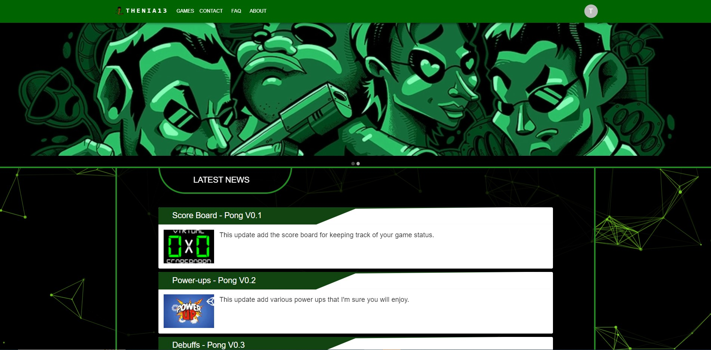
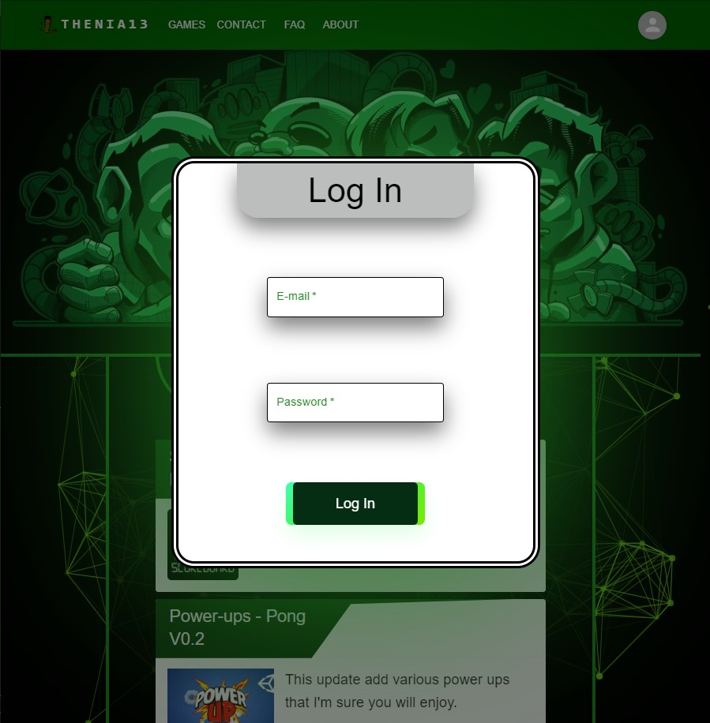

# Thenia13

## Story

Welcome to Thenia13! We are a community of passionate gamers, developers, and enthusiasts who are dedicated to bringing you the latest and greatest in the world of gaming. Our mission is to provide a platform where gamers can come together, connect, and share their love for gaming.

At Thenia13, we believe that gaming is more than just a hobby - it's a way of life. We know that the gaming community is one of the most vibrant and dynamic communities out there, and we want to help you stay connected to all the latest news, updates, and releases. Whether you're a casual gamer or a hardcore fan, we've got you covered.

### Backend technologies:
- [Java](https://dev.java/learn/)
- [Spring](https://docs.spring.io/spring-framework/docs/current/reference/html/index.html)
- [Hibernate](https://hibernate.org/orm/documentation/6.2/)
- [PostgreSQL](https://www.postgresql.org/docs/)

### Frontend technologies:
- [React](https://legacy.reactjs.org/docs/getting-started.html)
- [TypeScript](https://www.typescriptlang.org/docs/)
- [Material UI](https://mui.com/)
- [CSS](https://developer.mozilla.org/en-US/docs/Web/CSS)

### Project Features:

- Registration: Sign up for a Thenia13 account to access exclusive content, connect with other gamers, and stay up-to-date on the latest news and releases.

- Latest Games: Browse through our selection of our latest games, with detailed descriptions, screenshots, and reviews.

- Updates: Stay informed about all the latest updates and patches for your favorite games, with news and announcements posted regularly.

- User Profiles: Create your own user profile, where you can showcase your gaming achievements, connect with other gamers, and share your love for gaming.

- Forums: Join our community forums to discuss all things gaming, from strategies and tips to game reviews and news.

- Animated Background: Our website is designed with a stunning animated background, powered by [tsParticles](https://particles.js.org/docs/), to create a truly immersive and engaging experience.

### How to Run the Project?

- Clone the [Repo](https://github.com/CatalinCatta/Thenia13.git).

- Open backend folder, create a [.env](https://www.dotenv.org/docs/) file, coppy and paste .env.example 
file insed .env and fill it with your data.

- Run frontend and backend file in any IDE.

- Open https://localhost:3000 in a browser.

